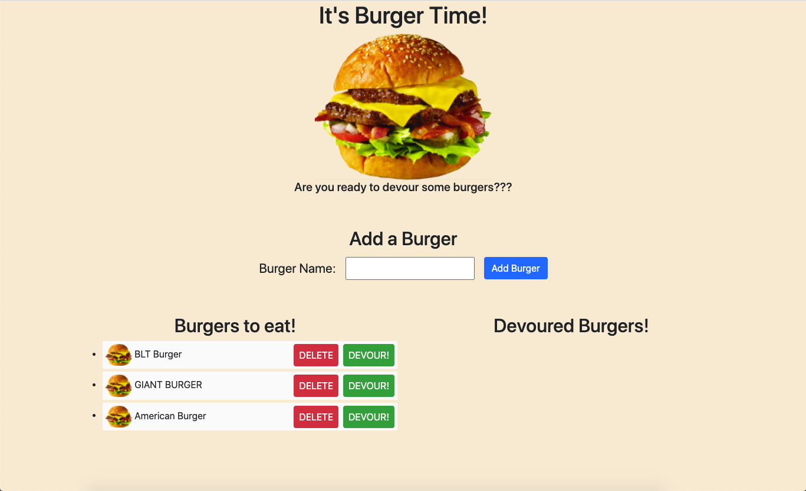
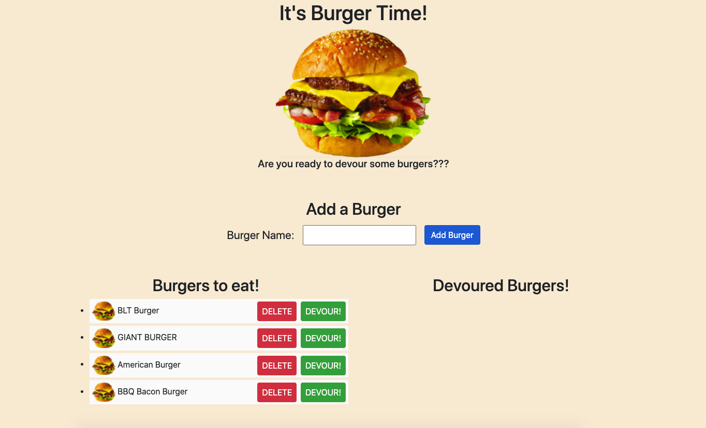
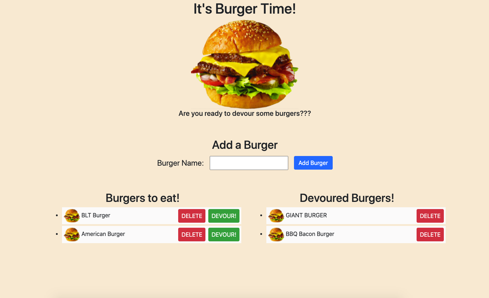
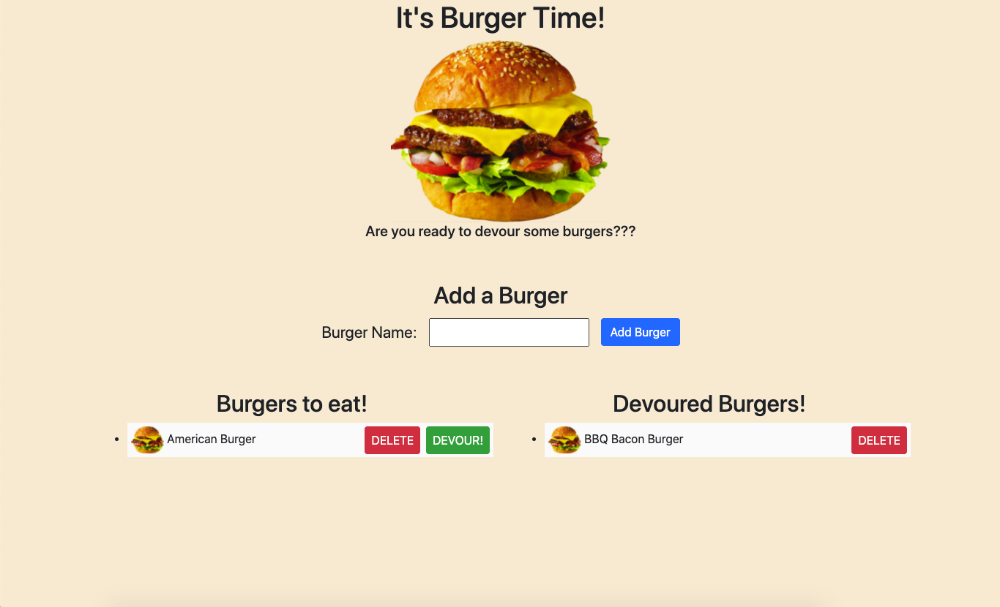

# Burger-Time332

## Description

For this project, I have created a burger logger app using MySQL, Node, Express, Handlebars and a homemade ORM. This app follows an MVC design pattern, using Node and MySQL to query and route data, while using Handlebars to generate the HTML.

## Table of Contents

* [Installation](#installation)
* [Usage](#usage)
* [License](#license)
* [Contributing](#Contributing)
* [Tests](#tests)
* [Questions](#questions)

## Installation

All the user needs to do is click the link to get started.

## Usage

Once the user has clicked the link, they are navigated to the main home page with a few seed data burgers already present. 

New burgers to devour can be added by typing the name of each burger into the form and clicking "Add Burger". 

The user can then devour a burger by clicking the "Devour!" button, and it will then move to the devoured list. 

Burgers can be deleted by clicking the corresponding "Delete" button, and the process can go on and on. 

Please enjoy, and bon appetit!

## License

This project is covered under the MIT License.  
Copyright (c) [2020] [Calvin Griffin]  
Permission is hereby granted, free of charge, to any person obtaining a copy of this software and associated documentation files (the "Software"), to deal in the Software without restriction, including without limitation the rights to use, copy, modify, merge, publish, distribute, sublicense, and/or sell copies of the Software, and to permit persons to whom the Software is furnished to do so, subject to the following conditions:
The above copyright notice and this permission notice shall be included in all copies or substantial portions of the Software.
THE SOFTWARE IS PROVIDED "AS IS", WITHOUT WARRANTY OF ANY KIND, EXPRESS OR IMPLIED, INCLUDING BUT NOT LIMITED TO THE WARRANTIES OF MERCHANTABILITY, FITNESS FOR A PARTICULAR PURPOSE AND NONINFRINGEMENT. IN NO EVENT SHALL THE AUTHORS OR COPYRIGHT HOLDERS BE LIABLE FOR ANY CLAIM, DAMAGES OR OTHER LIABILITY, WHETHER IN AN ACTION OF CONTRACT, TORT OR OTHERWISE, ARISING FROM, OUT OF OR IN CONNECTION WITH THE SOFTWARE OR THE USE OR OTHER DEALINGS IN THE SOFTWARE.

## Contributing

If you would like to contribute, please contact me via GetHub or email.

## Tests

Open it up and test it out.

## Questions

If you have any additional questions, please contact me via email or GitHub by clicking the links below.

Email: cgriffin332@gmail.com  
GitHub: https://github.com/cgriffin332